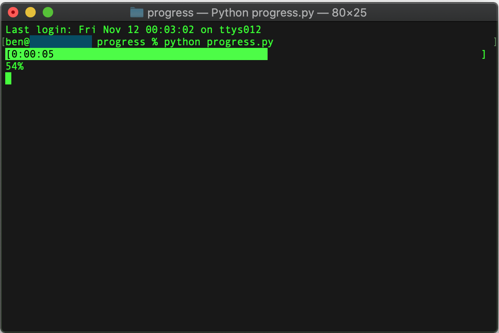

# Progress Bar

A very simple multiline progress bar class for python

## Usage

```python
# Initialize a 2 line progress bar
# The first line is text aligned right and the second left
# The first line will always has a percentage bar
pb = progress.ProgressBar([{'align': 'right'}, {'align': 'left'}])
# Give the bar an initial state
pb.refresh(0, "0%")

for i, thing in enumerate(things):

    # Do work here

    pct = (i+1) / len(things)
    # Refresh the progress bar with the percentage completion and
    # the two lines of text
    pb.refresh(
        pct,
        [
            f"{int(pct * 100):d}%",
            f"{thing.name}"
        ]
    )
    
    if some_condition:
        # Printing text will add it to above the progress bar.
        pb.print(f"We had a condition! {thing.name} {thing.status}")

pb.refresh(1, ["0%", "Done!"])
```

**Example Output**


